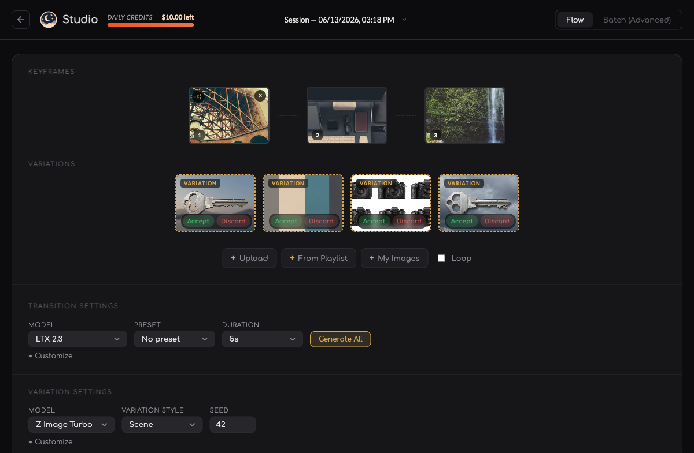
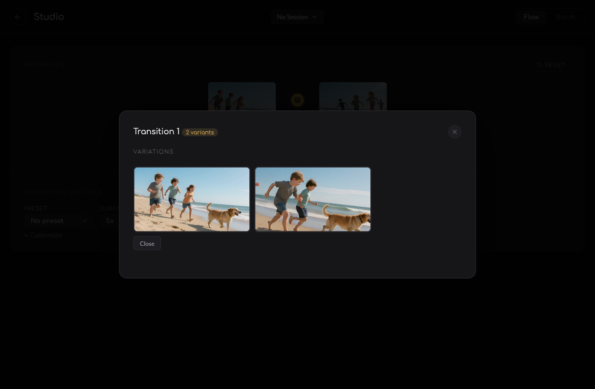
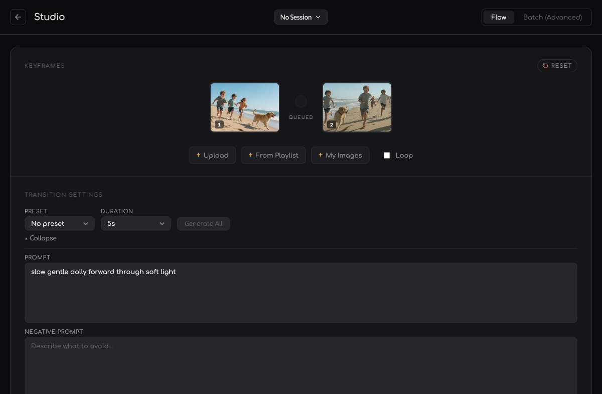

# Studio variations — screenshots

Captured from this branch running against the staging backend (real auth, real
GPU jobs). The variation generations below are real Z-Image-Turbo runs.

## Keyframe variations — one click fans out 4 on-theme variations

Click **Generate variations** on any keyframe → the Scene preset layers 4
modifiers onto the source prompt (stable seed). Candidates stage separately so
they don't derive transitions until you **Accept** one into the timeline.

## Transition variants — compare multiple takes in a lightbox

Generate several takes of a transition and compare them side-by-side; the badge
shows the variant count.

## Live progress — status streams over Socket.IO

Jobs report queued → generating → done in real time while rendering.

